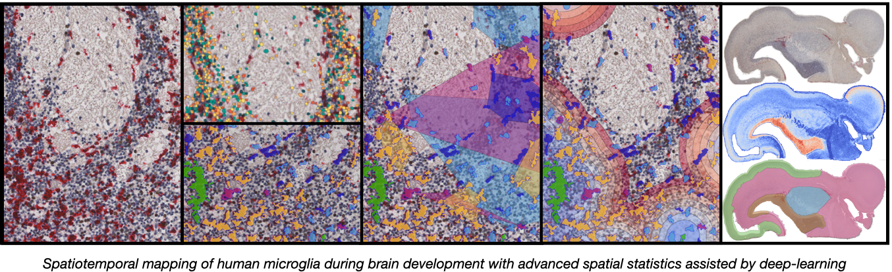

"""""""""""""""""
DeepCellMap
"""""""""""""""""

Algorithms associated with the submission of the paper titled "Spatiotemporal mapping of human microglia during brain development with advanced spatial statistics assisted by deep-learning" to Nature Methods. 

This directory contains all the source code needed to reproduce the results of the paper using different notebooks (doc/src/notebooks). Some intermediate results have been provided (doc/data) to speed up the calculation of spatiotemporal statistics on several pre-defined regions of interest. 

Below is a description of the notebooks, .py files and data provided to conduct the experiments. 

.. contents:: Overview
   :depth: 3

===================
Data
===================

----------------------
Input  
----------------------

- 3 IHC images of human fetal brain at 17,19 and 20 pcw. 
- Model classification microglial cells 
----------------------
Intermediate results 
----------------------

- Segmented & classified cells for the three IHC images. 
- Masks of the 4 anatomical regions (striatum, neocortex, cordical boundary, ganglionic eminence) for the three times. 

=========
Code 
=========

-----------------
Notebooks 
-----------------

DeepCellMap notebook 1 
-----------------
freg

--------
Python files details 
--------
Python files used in the notebooks 

General
----------

:const.py: grg r
:const_roi.py: regreg
:util.py: gregre

Region of interest (central)
-----------

:region_of_interest.py: greg

Image processing & Deep learning
-----------

:slide.py: 
:filter.py: 
:tiles.py: 
:Model_Segmentation.py: 
:util_classification.py: 
:Model_Classification.py: 
:labeling.py: 

Statistics
-----------
:colocalisation_analysis.py: 
:dbscan.py: 
:neighbours_analysis.py: 

Cellpose
-----------

:util_cellpose.py: 

Spatiotemporal analysis
-----------

:util_temporal_analysis.py: 
:temporal_analysis.py: 

====================================

+--------+--------+
| Image   | Post-conceptional-week |
+========+========+
| 001.tif  | 17  | 
+--------+--------+
| 002.tif  | 19   |
+--------+--------+
| 003.tif | 20  | 
+--------+--------+
