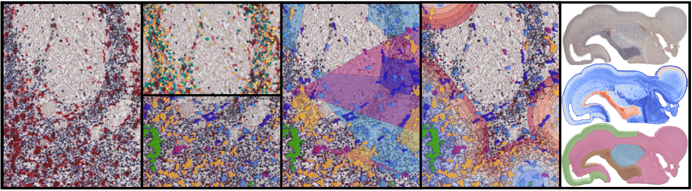

"""""""""""""""""
DeepCellMap
"""""""""""""""""

Algorithms associated with the submission of the paper titled "Spatiotemporal mapping of human microglia during brain development with advanced spatial statistics assisted by deep-learning" to Nature Methods. 

This directory contains all the source code needed to reproduce the results of the paper using different notebooks (doc/src/notebooks). Some intermediate results have been provided (doc/data) to speed up the calculation of spatiotemporal statistics on several pre-defined regions of interest. 

.. contents:: Overview
   :depth: 3

===================
Data
===================

----------------------
Input  
----------------------

- 3 IHC images of human fetal brain at 17,19 and 20 pcw. 
- Model classification microglial cells 
----------------------
Intermediate results provided
----------------------

- Segmented & classified cells for the three IHC images. 
- Masks of the 4 anatomical regions (striatum, neocortex, cordical boundary, ganglionic eminence) for the three times. 

=========
Code 
=========

-----------------
Notebooks 
-----------------

DeepCellMap notebook 1 - Image preprocessing and cells segmentation & classification
-----------------

Performs the different steps

- a.Image downscaling
- b.Mask extraction
- c.Tiling 
- d.Cells classification on the whole slide

DeepCellMap notebook 2 -  Selection different ROIs and computation statistics
-----------------

Performs the different steps 
- a.Selection ROIs in tissue
- b.Visualisation ROI and cells
- c.Cell-cell colocalisation
- d.Cell-Border colocalisation
- e.DBSCAN-based clusters analysis
- f.Neighbors analysis

DeepCellMap notebook 3 -  Spatiotemporal analysis
-----------------
Performs the different steps :
- a.Selection of regions to compare over time 
- b.Generation of statistical figures 

--------
Python files details 
--------
Python files used in the notebooks 

General
----------

:const.py: Contient toutes les constantes et paramètres du projet 
:const_roi.py: Configuration for ROI definition 
:util.py: Displaying functions, paths/image manipulation, measurement calculation time 

Region of interest (central)
-----------

:region_of_interest.py: Central - Contains the RegionOfInterest class for reconstructing an ROI and performing calculations on it 

Image processing & Deep learning
-----------

:slide.py: Used in image pre-processing - IHC image manipulation, downscaling 
:filter.py: Used in image pre-processing - Tissue extraction, filtering functions 
:tiles.py: Used in image pre-processing - Images tiling, generation of summary html 
:segmentation.py: Microglial cell segmentation functions 
:training_set_constitution.py: Used to create the training database
:train_classification_model.py:  and train the Unet Deep-Learning classification model 
:classification.py: Use to classify microglial cells on an entire image 
:training_set_constitution.py: 

Statistics
-----------
:colocalisation_analysis.py: Algorithms for Cell-cell colocalisation and Cell-region's border colocalisation analysis 
:dbscan.py: Algorithms for cluster analysis based on DBSCAN 
:neighbours_analysis.py: Algorithms for analysing neighbour-neighbour relationships  

Cellpose
-----------

:util_cellpose.py: Algorithms for region segmentation based on nuclei density obtained by cellpose  

Spatiotemporal analysis
-----------
:deepcellmap.py: Defines ROIs and applies the pipeline on them, gathers the results in dataframes for spatiotemporal analysis
:display_statistics.py: Generates statistical figures 
 
====================================

+--------+--------+
| Image   | Post-conceptional-week |
+========+========+
| 001.tif  | 17  | 
+--------+--------+
| 002.tif  | 19   |
+--------+--------+
| 003.tif | 20  | 
+--------+--------+
